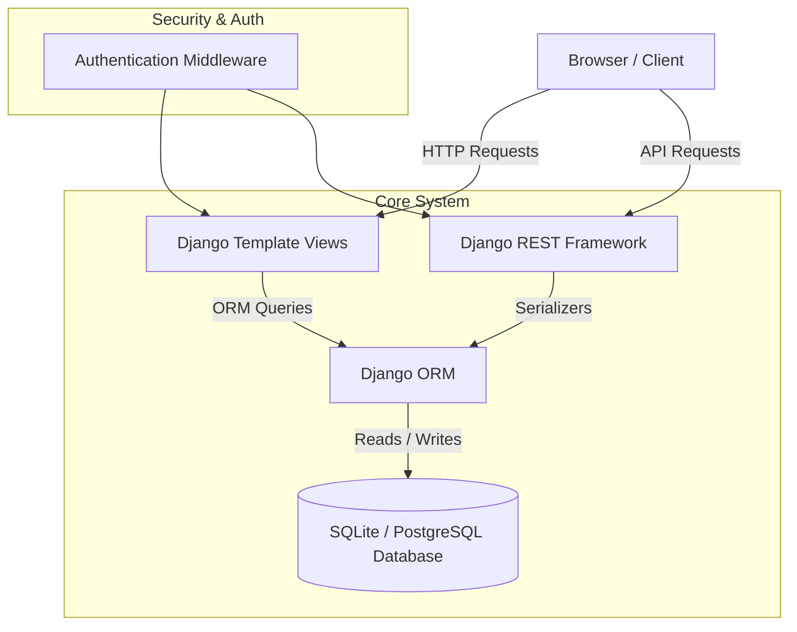

# 💼 JobTrack — Job Application Tracking System


**JobTrack** is a modern, full-stack web application designed for job seekers to track, organize, and analyze all their job and internship applications from a single, unified dashboard. Built with Django, Django REST Framework, SQLite (PostgreSQL ready), Bootstrap 5, and Chart.js.

---

## 🌟 Key Features

- 🔐 **Secure User Authentication**: Complete registration, login, logout, password validation, and strict per-user data isolation.
- 📊 **Interactive Dashboard & Analytics**: Stat cards for Total Applications, Applied, Assessments, Interviews, Offers, and Rejections alongside real-time Chart.js visual graphs.
- 📋 **Full CRUD Application Lifecycle**: Add, view, edit, and delete job applications with multi-stage tracking (`Saved`, `Applied`, `Assessment`, `Interview`, `Offer`, `Rejected`, `Withdrawn`).
- 🔍 **Advanced Search & Multi-Field Filtering**: Real-time search across company, position, location, and source. Filter by Status, Employment Type (`Full-time`, `Part-time`, `Internship`, `Contract`), and Priority (`Low`, `Medium`, `High`).
- ⚡ **RESTful API**: Full JSON REST API endpoints protected with Session/Basic authentication and strict user ownership filtering.
- 🎨 **SaaS-Grade UX/UI**: Clean glassmorphism styling, responsive top navigation, color-coded badges, and auto-dismissing feedback alerts.
- 🌱 **Automated Demo Data Seeder**: Instant management command to populate realistic Indian & Global tech applications (Google, Microsoft, Amazon, Swiggy, Razorpay, TCS, Zoho, etc.).

---

## 🏗️ Architecture



---

## 🗄️ Database Schema

```mermaid
erdiagram
    USER ||--o{ JOB_APPLICATION : owns
    USER {
        int id PK
        string username
        string email
        string password
    }
    JOB_APPLICATION {
        int id PK
        int user_id FK
        string company
        string position
        string location
        string employment_type
        string status
        date date_applied
        datetime interview_date
        decimal salary
        string job_url
        string source
        string priority
        text notes
        datetime created_at
        datetime updated_at
    }
```

---

## 🛠️ Technology Stack

- **Backend**: Python 3.x, Django 5.1, Django REST Framework 3.17, `python-dotenv`
- **Database**: SQLite (Development) / PostgreSQL-ready ORM structure
- **Frontend**: HTML5, CSS3 (Vanilla CSS + Glassmorphism), Bootstrap 5.3, Bootstrap Icons, Chart.js 4.x
- **Development & Testing**: Django TestCase, Git

---

## 🚀 Quick Start Guide

### 1. Prerequisites
Ensure you have **Python 3.10+** installed on your system.

### 2. Clone Repository & Setup Virtual Environment
```bash
git clone https://github.com/your-username/JobTrack.git
cd JobTrack

# Create virtual environment
python -m venv venv

# Activate virtual environment
# On Windows:
.\venv\Scripts\activate
# On macOS / Linux:
source venv/bin/activate
```

### 3. Install Dependencies
```bash
pip install -r requirements.txt
```

### 4. Configure Environment Variables
Copy `.env.example` to `.env`:
```bash
cp .env.example .env
```

### 5. Run Database Migrations
```bash
python manage.py makemigrations
python manage.py migrate
```

### 6. Seed Demo Data (Optional but Recommended)
Populate realistic demo job applications for immediate testing:
```bash
python manage.py seed_demo_data
```

### 7. Run Local Server
```bash
python manage.py runserver
```
Visit `http://127.0.0.1:8000/` in your browser.

---

## 🔑 Demo Credentials

For quick evaluation, run `python manage.py seed_demo_data` and log in with:

- **Username**: `demo`
- **Password**: `DemoPassword123!`

*(Note: These are development demo credentials only).*

---

## 📡 REST API Documentation

All API requests require authentication (Session or Basic Auth). Each user can only view and mutate their own applications.

| Endpoint | Method | Description |
| :--- | :--- | :--- |
| `/api/applications/` | `GET` | List all applications belonging to current user |
| `/api/applications/` | `POST` | Create a new job application |
| `/api/applications/<id>/` | `GET` | Retrieve single application detail |
| `/api/applications/<id>/` | `PUT` | Full update of an application |
| `/api/applications/<id>/` | `PATCH` | Partial update of an application |
| `/api/applications/<id>/` | `DELETE` | Delete an application |

### Sample POST Request (`/api/applications/`)

**Request Header:**
`Content-Type: application/json`

**Request Body:**
```json
{
  "company": "TCS",
  "position": "Software Engineer",
  "location": "Hyderabad",
  "employment_type": "Full-time",
  "status": "Applied",
  "priority": "High",
  "salary": 700000.00,
  "job_url": "https://careers.tcs.com/job/123",
  "source": "LinkedIn",
  "notes": "Awaiting online assessment link."
}
```

**Response (HTTP 201 Created):**
```json
{
  "id": 1,
  "user": "demo",
  "company": "TCS",
  "position": "Software Engineer",
  "location": "Hyderabad",
  "employment_type": "Full-time",
  "status": "Applied",
  "date_applied": null,
  "interview_date": null,
  "salary": "700000.00",
  "job_url": "https://careers.tcs.com/job/123",
  "source": "LinkedIn",
  "priority": "High",
  "notes": "Awaiting online assessment link.",
  "created_at": "2026-09-23T20:50:00Z",
  "updated_at": "2026-09-23T20:50:00Z"
}
```

---

## 🧪 Running Automated Tests

Run the full Django test suite covering Models, Authentication, Form Validation, Data Isolation, Views, and REST API Endpoints:

```bash
python manage.py test applications
```

---

## 📂 Project Structure

```
JobTrack/
├── manage.py
├── requirements.txt
├── README.md
├── .gitignore
├── .env.example
├── .env
│
├── jobtrack/
│   ├── __init__.py
│   ├── settings.py
│   ├── urls.py
│   ├── wsgi.py
│   └── asgi.py
│
├── applications/
│   ├── migrations/
│   ├── management/
│   │   └── commands/
│   │       └── seed_demo_data.py
│   ├── __init__.py
│   ├── admin.py
│   ├── apps.py
│   ├── forms.py
│   ├── models.py
│   ├── serializers.py
│   ├── urls.py
│   ├── views.py
│   └── tests.py
│
├── templates/
│   ├── base.html
│   ├── landing.html
│   ├── dashboard.html
│   ├── registration/
│   │   ├── login.html
│   │   └── register.html
│   └── applications/
│       ├── list.html
│       ├── detail.html
│       ├── form.html
│       └── confirm_delete.html
│
└── static/
    ├── css/
    │   └── style.css
    └── js/
        └── main.js
```

---

## 🔮 Future Improvements

- 📧 Email reminders for upcoming interview dates
- 📄 Resume attachment storage for specific applications
- 🌐 PostgreSQL production deployment blueprint with Docker
- 📥 CSV export of job application history

---

## 📄 License

This project is open-source and available under the [MIT License](LICENSE).
